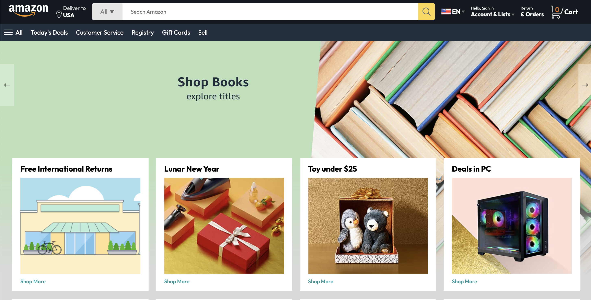
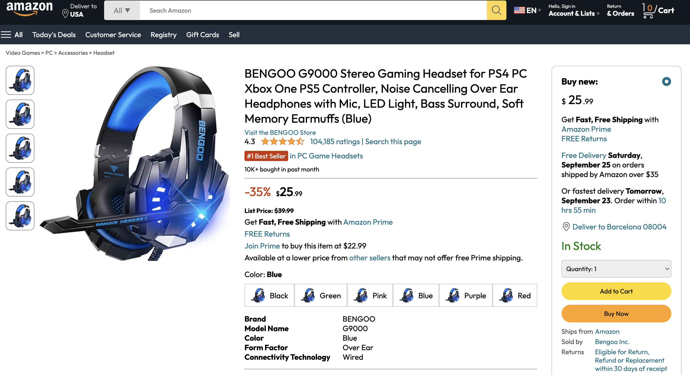
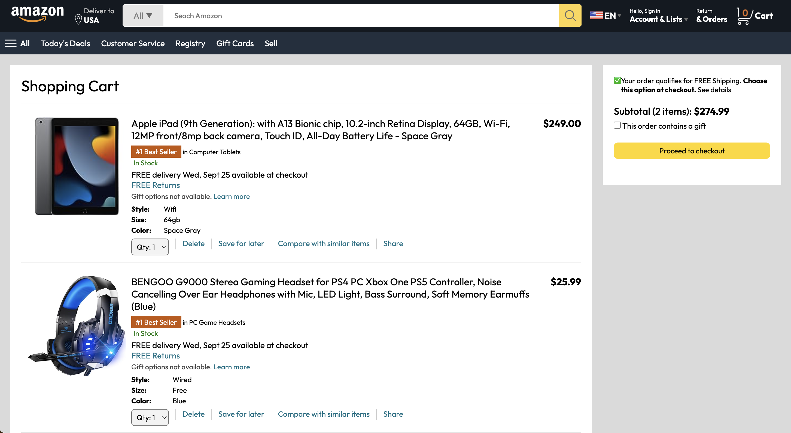
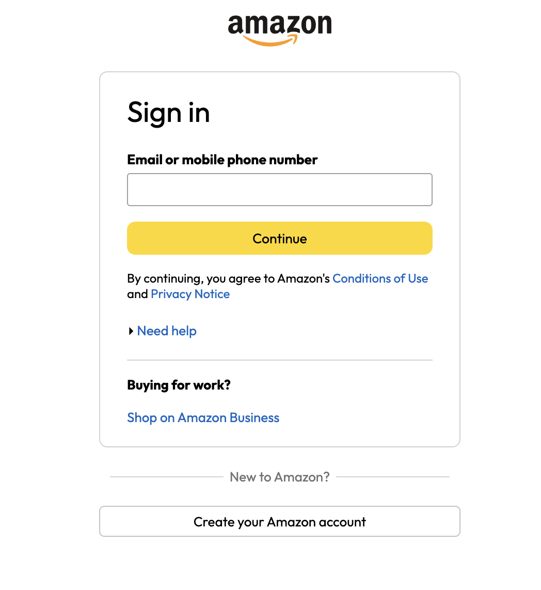
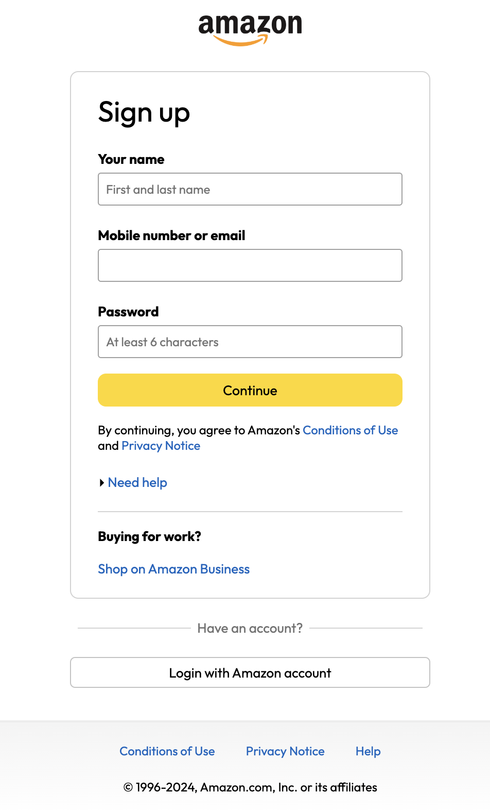

# Amazon Clone

 Amazon Clone Website Using HTML, CSS and JavaScript layout that includes navigation, product listings, sliders, and deals, providing a functional and visually similar experience to the real Amazon website.

## Features
- **Responsive Design**: Optimized for various screen sizes with media queries, ensuring usability on both mobile and desktop devices.
- **Header Navigation**: Includes top navigation with a logo, search bar, language selector, and cart icon.
- **Product Listings**: Multiple rows of products displayed with images, prices, discounts, and product descriptions.
- **Product Sliders**: Scrollable sliders featuring bestselling products and deals under $25.
- **Footer Section**: Contains Amazon branding and links to services.
- **Media Query Support**: The layout adapts on different screen sizes using CSS media queries.

## Technologies Used
- **HTML5**: For creating the structure of the web pages.
- **CSS3**: For styling, layout design, and making the site responsive.
- **JavaScript**: For basic slider functionality 

## How to Run the Project
1. Clone or download the project files.
2. Open `index.html` in your browser to view the Amazon Clone homepage.
3. Navigate to other pages like the sign-in page (`signin.html`) or cart page (`cart.html`) to explore the entire clone.

## Media Queries and Responsiveness
The project uses CSS media queries to ensure that the website is fully responsive. Layouts change based on the screen width:

- **For screens larger than 900px**: Standard layout with side-by-side product listings and navigation bars.
- **For screens smaller than 600px**: The product listings stack vertically, and images and text adjust in size for better readability.

---

=^..^= Enjoy !

# amazon-clone
  Home Page:

 

 Product:

 

Cart:

 

Sign in:

 

Sign up:

 

Tutorial by GreatStack
